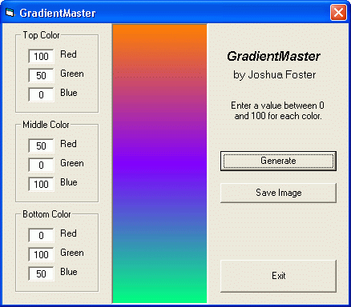



## GradientMaster

### Description

Don't laugh, it's my second VB program ever. It creates three-level gradients that can be saves as bitmaps. The vertical resolution is 500 pixels, so they look good even when stretched to fit the desktop.
 
### More Info
 
RGB color values between 0 and 100

             |
---                |---
**Submitted On**   |2002-04-11 23:50:16
**By**             |[Joshua Foster](https://github.com/Planet-Source-Code/PSCIndex/blob/master/ByAuthor/joshua-foster.md)
**Level**          |Beginner
**User Rating**    |3.3 (10 globes from 3 users)
**Compatibility**  |VB 6\.0
**Category**       |[Graphics](https://github.com/Planet-Source-Code/PSCIndex/blob/master/ByCategory/graphics__1-46.md)
**World**          |[Visual Basic](https://github.com/Planet-Source-Code/PSCIndex/blob/master/ByWorld/visual-basic.md)
**Archive File**   |[GradientMa711954122002\.zip](https://github.com/Planet-Source-Code/joshua-foster-gradientmaster__1-33720/archive/master.zip)

